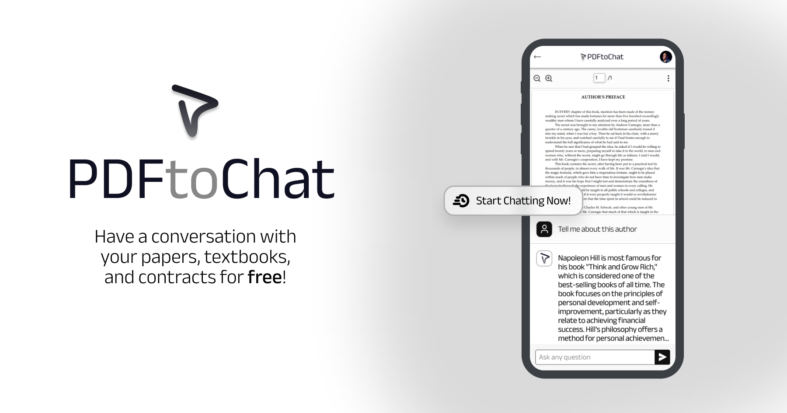

<a href="https://www.pdftochat.com/">
  
  <h1 align="center">PDFToChat</h1>
</a>

<p align="center">
  Chat with your PDFs in seconds. Simplified, lightweight, and runs completely in Next.js.
</p>

<p align="center">
  <a href="#features"><strong>Features</strong></a> ·
  <a href="#tech-stack"><strong>Tech Stack</strong></a> ·
  <a href="#getting-started"><strong>Getting Started</strong></a> ·
  <a href="#how-it-works"><strong>How It Works</strong></a>
</p>
<br/>

## Features

- ✅ **No Database Required** - All processing happens in-memory
- ✅ **No Authentication** - Simple, public Q&A interface
- ✅ **Document Selection** - Choose which PDFs to include in your session
- ✅ **Page-Level Citations** - Get exact page numbers for sources
- ✅ **Session-Based** - Each user gets an isolated session (1 hour timeout)
- ✅ **Minimal Resources** - Lightweight and efficient
- ✅ **Easy Setup** - Just add PDFs and an OpenAI API key

## Tech Stack

- **Framework**: Next.js 13 (App Router)
- **LLM**: OpenAI GPT-4 Turbo
- **Embeddings**: OpenAI Embeddings
- **RAG Framework**: [LangChain.js](https://js.langchain.com/)
- **Vector Store**: In-Memory (no external database)
- **PDF Viewer**: [@react-pdf-viewer](https://react-pdf-viewer.dev/)
- **Styling**: Tailwind CSS

## Getting Started

### 1. Clone the repository

```bash
git clone https://github.com/yourusername/pdftochat.git
cd pdftochat
```

### 2. Install dependencies

```bash
npm install
```

### 3. Set up environment variables

Create a `.env.local` file in the root directory:

```bash
cp .env.example .env.local
```

Add your OpenAI API key:

```
OPENAI_API_KEY=sk-...
```

Get your API key from: https://platform.openai.com/api-keys

### 4. Add your PDF documents

Place your PDF files in the `/public/documents/` directory:

```bash
# Example
cp /path/to/your/document.pdf public/documents/
```

The app will automatically detect and list all PDFs in this directory.

### 5. Run the development server

```bash
npm run dev
```

Open [http://localhost:3000](http://localhost:3000) in your browser.

### 6. Use the application

1. **Select Documents**: Choose one or more PDFs from the list
2. **Start Session**: Click "Start Q&A Session" to process the documents
3. **Ask Questions**: Chat with your documents and get page-specific citations
4. **Jump to Sources**: Click on page citations to view the exact location in the PDF

## How It Works

### Architecture

```
User selects PDFs → Process & embed → In-memory vector store → RAG chat → Page citations
```

### Simplified Flow

1. **Document Selection**: User selects PDFs from `/public/documents/`
2. **Processing**: PDFs are loaded, split into chunks, and embedded using OpenAI
3. **Session Creation**: Vector store is created in-memory with a unique session ID
4. **Chat**: User asks questions, relevant chunks are retrieved, and GPT-4 generates answers
5. **Citations**: Sources include document name and page number for verification

### Session Management

- Sessions are stored in-memory (no database)
- Each session expires after 1 hour of inactivity
- Automatic cleanup runs every 10 minutes
- Multiple concurrent sessions are supported

## File Structure

```
pdftochat/
├── app/
│   ├── page.tsx                    # Document selection page
│   ├── chat/page.tsx              # Chat interface with PDF viewer
│   └── api/
│       ├── documents/route.ts     # List available PDFs
│       ├── process/route.ts       # Process selected PDFs
│       └── chat/route.ts          # RAG chat endpoint
├── lib/
│   ├── document-scanner.ts        # Scan /public/documents/
│   ├── pdf-processor.ts           # Load & embed PDFs
│   └── session-manager.ts         # In-memory session storage
├── public/
│   └── documents/                 # Place your PDFs here
└── utils/
    └── ragChain.ts               # LangChain RAG configuration
```

## Configuration

### Customizing the LLM

Edit `/app/api/chat/route.ts` to change the model:

```typescript
const model = new ChatOpenAI({
  modelName: 'gpt-4-turbo-preview', // Change to gpt-3.5-turbo for faster/cheaper responses
  temperature: 0,
});
```

### Customizing Chunk Size

Edit `/lib/pdf-processor.ts`:

```typescript
const textSplitter = new RecursiveCharacterTextSplitter({
  chunkSize: 1000,      // Adjust chunk size
  chunkOverlap: 200,    // Adjust overlap
});
```

### Session Timeout

Edit `/lib/session-manager.ts`:

```typescript
// Clean up sessions older than 1 hour
const oneHourAgo = new Date(Date.now() - 60 * 60 * 1000); // Change duration here
```

## Deployment

### Deploy to Vercel

1. Push your code to GitHub
2. Import the repository in Vercel
3. Add environment variable: `OPENAI_API_KEY`
4. Deploy!

**Note**: Make sure to add your PDFs to `/public/documents/` before deploying, or update them after deployment.

### Other Platforms

This is a standard Next.js app and can be deployed to any platform that supports Next.js:
- Netlify
- Railway
- Digital Ocean
- AWS Amplify
- Self-hosted

## Common Questions

### Q: Can I use other LLMs?
A: Yes! Replace `ChatOpenAI` with any LangChain-supported LLM (Anthropic, Cohere, etc.)

### Q: How many documents can I process?
A: Limited only by available RAM. Start with 3-5 documents and monitor memory usage.

### Q: Can I add authentication?
A: Yes, but this template intentionally omits auth for simplicity. Add NextAuth.js or similar if needed.

### Q: Is this suitable for production?
A: For small-scale use, yes. For high-traffic production, consider:
- Adding a persistent vector database (Pinecone, Weaviate)
- Implementing authentication
- Using Redis for session storage
- Adding rate limiting

## Credits

Original template by [samselikoff](https://github.com/samselikoff/pdftochat)

Radically simplified by removing:
- Clerk authentication
- PostgreSQL database
- Pinecone/MongoDB vector stores
- Bytescale file uploads
- Together AI

## License

MIT
